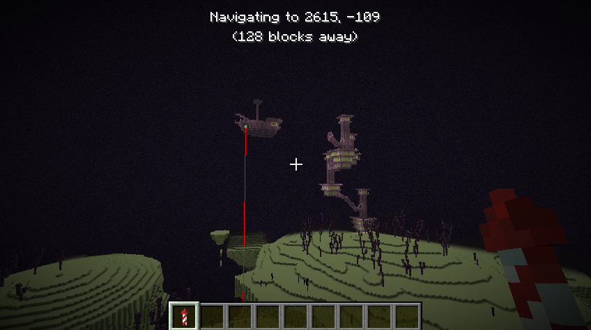

# PRC

**clientside** mod for fabric that makes grinding for elytras easier by navigating you to the nearest end city with an elytra



works both in singleplayer and multiplayer mode, but requires you to input the world seed in the latter

## Usage

turn the mod on with the `H` button (you can change the keybinds in the settings). after that simply follow the trail to the nearest end ship, take the elytra, and the mod will automatically find another one. when you're done, simply press the `H` button again to turn the mod off.

**if the mod navigates you to an already looted end ship, press `K` to skip it**

## Installation

1. download the zip archive from the [releases page](https://github.com/master30f/prc/releases)
2. extract it
3. move the jar file into your `mods` folder
4. move the executable into your minecraft installation's home folder (`.minecraft`)

## Building

### Server

```
$ cd ./server/lib/cubiomes
$ make libcubiomes
$ cd ../..
$ ./build.sh
```

### Mod

run the `build > jar` gradle task

## How it works

the mod is split into two parts: the fabric mod, which is responsible for drawing the UI and a native server application which uses the [cubiomes library](https://github.com/Cubitect/cubiomes) to find end cities.
the mod spawns the server as a subprocess and then communicates with it through stdin/out.